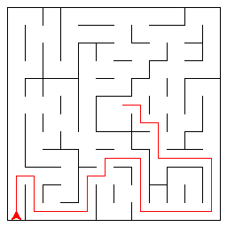
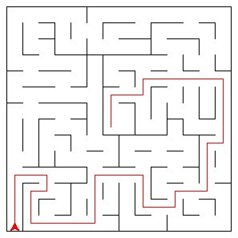
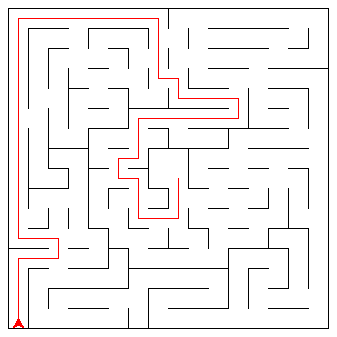
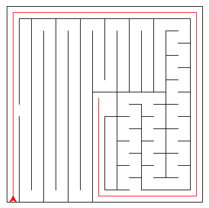
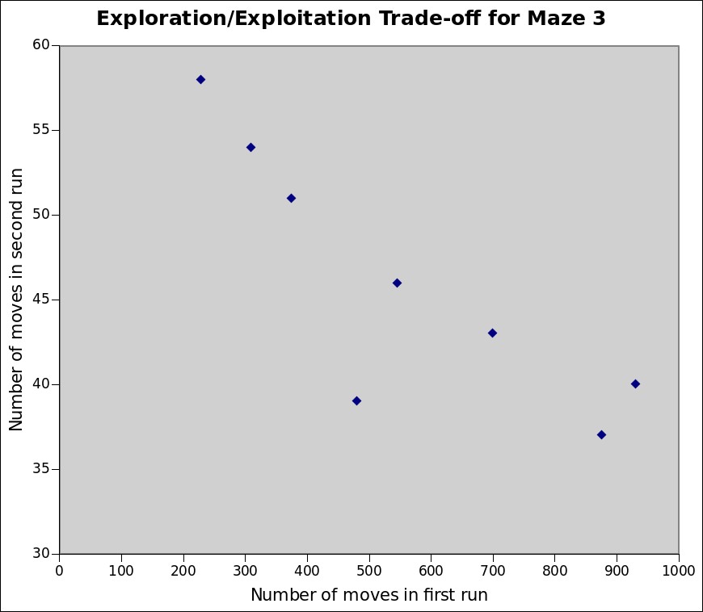

# Machine Learning Engineer Nanodegree
## Capstone Project
David Christensen
April 1st, 2017

## I. Definition

### Project Overview
Micromouse competitions have been around since the late 1970's. In the competition, a robot mouse solves a 16x16 maze. The mouse gets two runs: the first to explore the maze and the second to find its way to the goal in the center of the maze. The mice are ranked based on how much time they use in the first and second runs.

While the real micromouse competitions use physical robot mice, this project just simulates the maze and movement of the mouse in discrete timesteps. Each maze is a virtual grid. It is stored in a text file that defines where the walls are. The mazes range from 12x12 to 16x16.

### Problem Statement

Like the real competitions, the mouse gets two runs--the first to explore the maze and the second to get to the center as fast as possible.

The purpose of the first run is to explore the maze. In Naoki Shibuya's capstone project he uses four types of exploration algorithms:
 - Random
 - Dead end avoidance
 - Visit count
 - Visit count with heuristic
 For more information see [his paper](https://github.com/udacity/machine-learning/blob/master/projects/capstone/report-example-3.pdf).
 
 I will use the random and visit count methods to do my exploration as well as trying A\*. A\* is normally used to find the shortest path to the goal when the maze is already known. My algorithm uses A\* to reach the goal by re-planning every time something new is learned like Stanley, the car that won the DARPA challenge for self driving cars. It then switches the heuristic to go back to the start. Once it reaches the start, it goes back towards the goal again. It continues in this way until it traverses the same path to the goal twice. This should be the shortest path.
 
 The greater the maze coverage that the robot can get in the first run, the more likely it is to find the shortest path in the second run. Since the moves in the second run are 30 times more expensive than the moves in the first run, it makes sense to use 30 more moves during run 1 to decrease the shortest path by one move during run 2.

The purpose of the second run is to get to the goal as fast as possible. While there are multiple ways to find the path to the goal of a maze, A\* will find the shortest path efficiently. If the whole maze is not explored, the algorithm will have to be re-run every time something new is seen just like in the exploration phase. I use A\* in the second run for all of my controllers.

I expect that the visit count controller will be the most consistently best performer, but I expect the A\* return algorithm to work better on some mazes.

### Metrics

These are the metrics I have defined for evaluating my algorithms:

 - N1: Number of moves in the first run
 - N2: Number of moves in the second run
 - Mouse score: N2 + N1/30
 - Exploration Efficiency: j / N1 where j is number of known maze cell junctions (walls or not walls)
 
N1 and N2 give me the ability to compare how well each algorithm explores or exploits its knowledge about the maze. This can give some indication on why the algorithm performs well or does not perform well. The score is the main metric for evaluating an algorithm. The algorithms must balance between exploration and exploitation to get a good score. The exploration efficiency is another way to determine why an algorithm works well. An algorithm that always explores new territory will have a higher efficiency score than an algorithm that repeatedly traverses the same path. If one of the algorithms has a low efficiency and a high number of moves in the first run, you know that it could be stuck in a loop, dead end, or just doesn't effectively explore.

## II. Analysis

### Data Exploration

The mazes are defined by input files which have 4-bit integers where the bits represent which sides of each square have walls. The mouse can occupy one square at a time and moves in discrete jumps. The mouse cannot move through walls. The center of the maze is a 2x2 goal area. After the mouse reaches the goal on the first run, it can keep exploring or choose to end the run. The mouse starts both runs in the bottom left corner, facing up. The starting square has walls on three sides with the open side facing up. There is a wall running around the outside of the maze blocking the mouse from leaving.

Some of the first questions I had when starting this project was why the mouse doesn't have a back sensor and why the tester does not provide the location of the robot in the next_move method. After thinking it through, the mouse does not need a back sensor since it is known the mouse starts at 0,0 with walls on three sides. Since the mouse first rotates, then moves, it will see any square using its sensors before it gets there. The tester does not provide the location of the robot because robots in the real world have to perform localization. Due to the discrete nature of the simulation and the exact movements, there will never be any doubt about where the robot is as long as it doesn't make a move that would crash it into a wall.

Each maze has some characteristics that make it difficult or impossible for some maze solving algorithms to work. For example, in all three test mazes the goal walls are not connected to the outer walls of the maze. This would prevent a wall-following algorithm from finding the goal.

### Exploratory Visualization

Shortest paths:

#### Maze 1

#### Maze 2

#### Maze 3

As can be seen in each of these mazes, the shortest path (in terms of number of moves) goes to the outside of the maze. Due to the heuristic, A\* is not ideally suited to explore the outer edges of the maze. For example, here is a visualization of the heuristic value for each cell in maze 1:

4 4 3 3 3 2 2 3 3 3 4 4  
4 4 3 3 3 2 2 3 3 3 4 4  
3 3 2 2 2 1 1 2 2 2 3 3  
3 3 2 2 2 1 1 2 2 2 3 3  
3 3 2 2 2 1 1 2 2 2 3 3  
2 2 1 1 1 0 0 1 1 1 2 2  
2 2 1 1 1 0 0 1 1 1 2 2  
3 3 2 2 2 1 1 2 2 2 3 3  
3 3 2 2 2 1 1 2 2 2 3 3  
3 3 2 2 2 1 1 2 2 2 3 3  
4 4 3 3 3 2 2 3 3 3 4 4  
4 4 3 3 3 2 2 3 3 3 4 4  

At the goal the heuristic is 0 and the numbers get higher the further away the cell is. This causes the A\* algorithm to want to stay aligned with the goal and as close to it as possible. In maze 1 the shortest path goes around the outside of the maze in the bottom right corner where the heuristic is the highest. The A\* algorithm will not find the shortest path quickly in this circumstance. There is a difference though in how fast the algorithm runs versus how fast the robot finds the goal. Once A\* is done, it has found the shortest path (according to the knowledge it has of the maze). This means it will find the center of the maze quickly.

As Shibuya has shown, the robot must avoid dead ends and loops. The random algorithm will not avoid them and A\* and the visit count both will avoid them as soon as they are known.

### Algorithms and Techniques

There are two kinds of algorithms the robot needs to use. The first is for exploration and the second is for seeking the goal. If the robot has explored enough of the maze to have discovered the shortest path in run 1, A\* is the optimal algorithm for using on the second run since it is guaranteed to find the shortest path if it knows the entire maze. I used A\* for each of the algorithms on the second run which makes the exploration algorithms of more interest. In the following sections I will describe each of the exploration algorithms.

#### Random algorithm

The random algorithm simply chooses a move at random from the possible moves. It will not move in any specific direction, avoid loops or dead ends. This algorithm is included only as a benchmark. Any algorithm that is worth using should outperform it.

#### Visit count algorithm

This algorithm keeps track how many times it has visited each cell. When it chooses between the possible moves, it will choose the one with the lowest number of visits. This basically provides a gradient which the robot follows down-hill. This pushes the robot away from areas it has already explored. This algorithm is efficient for exploring the maze. It is not directional like A\*, but as long as the algorithm enters the goal at some point, that's fine. The stopping criteria could have a large effect on the final score. Shibuya added a heuristic to break ties for this algorithm and it seems to have worked quite well. 

#### A\* Return Algorithm

The idea behind this algorithm is that you don't need to explore the entire maze to find the shortest path. Since A\* is guaranteed to find the shortest path, if it goes from the start to the goal enough times, it will discover the shortest path. The mouse first tries to make its way to the goal. When it discovers a new wall, it re-plans the route. Once at the goal, it returns to the start, re-planning when necessary. The first time it makes it all the way to the goal without  seeing any new walls, it will have found the shortest path and the mouse is reset for run 2.

### Benchmark

The benchmark for the different algorithms is the random algorithm. I will be comparing results for the other algorithms against this one.

## III. Methodology

### Data Pre-processing

There was no data pre-processing required because the mouse knows nothing about the maze in the beginning.

### Implementation

#### Controllers

I created a base class and 4 sub-classes for controlling the robot:
 - RobotController (the base class)
 - RandomController
 - VisitCountController
 - PureAStarController
 - AStarReturnController
 
##### RobotController

The RobotController class is responsible for directing the overall strategy of the robot. The RobotController base class defines the next\_move method which all of the other subclasses must implement. This is the method called by the robot class. It also implements a number of other useful methods that the subclasses can take advantage of. The base class owns the maze map, the location and heading of the robot, and the planner used to get the next move.

##### RandomController

This class implements the random mouse algorithm. It chooses the next move from a list of possible moves. The possible moves are the ones that won't run the robot into a wall.

##### VisitCountController

This class uses two different planners. It uses the VisitCountPlanner during run 1 and the AStarPlanner during run 2. To end the first run the controller must have explored a certain percentage of the maze as well as enter the goal area at some point during the process. Once in run 2, the planner is switched over to the AStarPlanner and the controller tries to make it to the goal as fast as possible.

##### PureAStarController

This controller uses the AStarPlanner exclusively and is very simple. It just uses A\* to get to the goal as fast as possible for both runs.

#### Planners

I created a Planner base class and three planner sub-classes:

##### Planner

The Planner is responsible for deciding what the next move should be. This is the base class for the other planners and is used by the different controller classes. It defines a next_move method which is overridden by each of the sub-classes. It also defines the re-plan method which is called whenever the map is updated. It is really only necessary for the AStarPlanner, but is included for convenience. The Planner class also keeps track of the percentage of the maze visited by the robot.

##### RandomPlanner

The RandomPlanner just chooses a random move from the list of available moves every time next_move is called.

##### VisitCountPlanner

The VisitCountPlanner keeps track of the places it has been in the maze and chooses the move that gets it to the square with the least amount of visits.

##### AStarPlanner

This is the planner used in run 2 by all controllers. It implements the A\* algorithm. It is initialized with the maze map and a MazeHeuristic class. The MazeHeuristic can be switched out by the AStarReturnController to direct the robot either to the goal or back to the start.

#### MazeMap

The MazeMap class is used by the planner classes, the heuristic classes and the controller classes. It keeps track of known walls and can provide a list of possible moves given a location and direction. It is basically a graph where the nodes are positions in the maze and the edges are the junctions between the cells (whether is has a wall or not).

### Refinement

After trying out the PureAStarController, I was unable to get a better score than using the VisitCountPlanner. I started thinking of ways that would improve the exploration. I came to the conclusion that the VisitCountPlanner was hard to beat in terms of efficiently exploring an unknown maze since it will always choose a cell it hasn't been to over a cell it has been to. Once I realized that I actually don't want to explore the whole maze, I made a breakthrough. The only part of the maze that I actually want to explore is the shortest path. The A\* algorithm is guaranteed to get the shortest path given an admissible heuristic (one that does not over estimate the number of moves to the goal). It makes sense then, that if you were to send the robot back and forth between the goal and the start square, it would learn the shortest path eventually without exploring the entire maze. That's where the idea for the AStarReturnController came from.

##### AStarReturnController

Similar to the PureAStarController, this controller exclusively uses A\*, but instead of resetting after hitting the goal, it changes the heuristic in the A\* planner to get back to the start square at (0,0). When it reaches the start square, it switches the heuristic back to get back to the goal. It will go back and forth between the start square and the goal until it no longer has to re-plan on the way to the goal. At this point it has found the optimal path since if there was a better path in an unexplored part of the maze (which has no walls as far as A\* is concerned) it would go towards the unexplored part of the maze, discover new walls, and have to re-plan. On the second run, it just goes to the goal as fast as possible using A\* since it has found the optmal path.

## IV. Results

### Model Evaluation and Validation

#### RandomController

since the random controller will traverse a different path every time, I ran the controller multiple times on each maze and found the median result because the median is a more robust measure of central tendency and there is no way to compute a mean with NA entries. Here are the results:

##### Maze 1

| Iteration | Run 1 moves | Run 2 moves | Score | Exploration Efficiency |
| --- | --- | --- | ---: | ---: |
| 1 | 654 | 32 | 53.800 | 0.422 |
| 2 | 693 | 17 | 40.100 | 0.444 |
| 3 | 690 | 23 | 46.000 | 0.438 |
| 4 | 360 | 25 | 37.000 | 0.672 |
| 5 | NA | NA | NA | NA |
| 6 | 953 | 20 | 51.767 | 0.301 |
| 7 | NA | NA | NA | NA |
| 8 | 202 | 25 | 31.733 | 0.955 |
| 9 | NA | NA | NA | NA |
| 10 | 511 | 23 | 40.033 | 0.568 |
| 11 | NA | NA | NA | NA |
| 12 | 812 | 17 | 44.067 | 0.376 |
| 13 | 157 | 32 | 37.233 | 1.115 |
| 14 | 77 | 27 | 29.567 | 2.299 |
| 15 | 432 | 22 | 36.400 | 0.613 |
| Median | 511 | 23 | 40.033 | 0.568

##### Maze 2

| Iteration | Run 1 moves | Run 2 moves | Score | Exploration Efficiency |
| --- | --- | --- | ---: | ---: |
| 1 | 544 | 51 | 69.133 | 0.577 |
| 2 | NA | NA | NA | NA |
| 3 | NA | NA | NA | NA |
| 4 | NA | NA | NA | NA |
| 5 | 943 | 33 | 31.433 | 0.378 |
| 6 | 919 | 28 | 58.633 | 0.362 |
| 7 | 238 | 42 | 49.933 | 1.025 |
| 8 | NA | NA | NA | NA |
| 9 | NA | NA | NA | NA |
| 10 | 87 | 61 | 63.900 | 2.621 |
| 11 | 404 | 40 | 53.467 | 0.705 |
| 12 | 409 | 36 | 49.633 | 0.841 |
| 13 | 609 | 32 | 52.300 | 0.571 |
| 14 | NA | NA | NA | NA |
| 15 | 738 | 30 | 54.600 | 0.465 |
| Median | 544 | 36 | 53.467 | 0.577 |

##### Maze 3

| Iteration | Run 1 moves | Run 2 moves | Score | Exploration Efficiency |
| --- | --- | --- | ---: | ---: |
| 1 | NA | NA | NA | NA |
| 2 | 375 | 51 | 63.500 | 0.933 |
| 3 | NA | NA | NA | NA |
| 4 | 310 | 54 | 64.333 | 1.013 |
| 5 | NA | NA | NA | NA |
| 6 | NA | NA | NA | NA |
| 7 | NA | NA | NA | NA |
| 8 | 545 | 46 | 64.167 | 0.550 |
| 9 | 876 | 37 | 66.200 | 0.540 |
| 10 | 228 | 58 | 65.600 | 1.404 |
| 11 | NA | NA | NA | NA |
| 12 | NA | NA | NA | NA |
| 13 | 699 | 43 | 66.300 | 0.595 |
| 14 | 930 | 40 | 71.000 | .460 |
| 15 | 481 | 39 | 55.033 | 0.798 |
| Median | 513 | 44.5 | 64.9665 | 0.6965

#### VisitCountController

| Maze | Run 1 moves | Run 2 moves | Score | Exploration Efficiency |
| --- | --- | --- | ---: | ---: |
| 1 | 202 | 17 | 23.733 | 1.441 |
| 2 | 226 | 24 | 31.533 | 1.726 |
| 3 | 303 | 44 | 54.100 | 1.647 |

#### PureAStarController

| Maze | Run 1 moves | Run 2 moves | Score | Exploration Efficiency |

#### PureAStarController

| Maze | Run 1 moves | Run 2 moves | Score | Exploration Efficiency |
| --- | --- | --- | ---: | ---: |
| 1 | 39 | 26 | 27.300 | 4.385 |
| 2 | 70 | 43 | 45.333 | 3.543 |
| 3 | 47 | 55 | 56.567 | 4.723 |

#### AStarReturnController

| Maze | Run 1 moves | Run 2 moves | Score | Exploration Efficiency |
| --- | --- | --- | ---: | ---: |
| 1 | 201 | 17 | 23.700 | 1.398 |
| 2 | 198 | 22 | 28.600 | 1.924 |
| 3 | 302 | 25 | 35.067 | 1.573 |

### Justification

#### Maze 1

| Controller | Run 1 moves | Run 2 moves | Score | Exploration Efficiency |
| --- | --- | --- | ---: | ---: |
| RandomController | 511 | 23 | 40.033 | 0.568 |
| VisitCountController | 202 | 17 | 23.733 | 1.441 |
| PureAStarController | 39 | 26 | 27.300 | 4.385 |
| AStarReturnController | 201 | 17 | 23.700 | 1.398 |

As can be seen in the results for maze 1, the random controller was the worst performer in terms of score as expected. The A\* return controller was the best, but was very close to the visit count controller. The pure A\* controller also worked well, but not as well as the VisitCount and AStarReturn controllers. One interesting thing to note is the efficiency number. The pure A\* controller was by far the best performer in terms of exploration efficiency. The reason for this is probably that it is less focused on exploration than the other controllers which is counter-intuitive at first. Since it is less focused on exploration, it has far fewer timesteps than the other three. Since efficiency is j / N1 (where j is number of known cell junctions (walls or non-walls) and N1 is the number of timesteps in the first run), decreasing N1 or increasing j will improve the efficiency score. The pure A\* controller has the lowest N1 by far which explains the impressive efficiency value.

#### Maze 2

| Controller | Run 1 moves | Run 2 moves | Score | Exploration Efficiency |
| --- | --- | --- | ---: | ---: |
| RandomController | 544 | 36 | 53.467 | 0.577 |
| VisitCountController | 226 | 24 | 31.533 | 1.726 |
| PureAStarController | 70 | 43 | 45.333 | 3.543 |
| AStarReturnController | 198 | 22 | 28.600 | 1.924 |

For maze 2, the controllers rank in the same order as before, but with the bigger maze the differences between them are more pronounced. The A\* return controller was again the best performer, but not by a wide margin. The pure A\* controller on the other hand did much worse with a larger maze and was cloer to the random controller than the other two. This is likely due to the lack of exploration. Since it explores very little of the maze in the first run, it ends up doing more exploration in the second run when it is 30 times more costly.

#### Maze 3

| Controller | Run 1 moves | Run 2 moves | Score | Exploration Efficiency |
| --- | --- | --- | ---: | ---: |
| RandomController | 513 | 44.5 | 64.9665 | 0.6965 |
| VisitCountController | 303 | 44 | 54.100 | 1.647 |
| PureAStarController | 47 | 55 | 56.567 | 4.723 |
| AStarReturnController | 302 | 25 | 35.067 | 1.573 |

Once again, with a larger maze, the differences were even more pronounced. The A\* return controller is now the clear winner while the visit count and pure A\* controllers are far behind. You may notice that it took approximately the same number of moves in the first runs for the visit count and A\* return controllers, the main difference in their score was run 2. This result really highlights the benefit of the A\* return controller over the visit count controller. _Instead of being a general exploration algorithm, it only explores the parts of the maze that A\* thinks could possibly be a shorter path._ On larger and larger mazes, this becomes more and more important since the shortest path will cover less and less of the maze.

#### Hard Maze

The AStarReturn algorithm is not the best in all cases though. I came up with a maze that shows one way to trick it into exploring a really large section of the maze when the real shortest path is very simple. Here is the maze with the shortest path marked:

The shortest path on this maze goes around the outside of the maze where the heuristic values are higher. This is the achilles heel of the AStarReturnAlgorithm. After running the different algorithms on this maze, here is the result:

##### Random Controller
| Iteration | Run 1 moves | Run 2 moves | Score | Exploration Efficiency |
| --- | --- | --- | ---: | ---: |
| 1 | 659 | 155 | 176.97 | 0.40 |
| 2 | 418 | 176 | 189.93 | 0.53 |
| 3 | NA | NA | NA | NA |
| 4 | NA | NA | NA | NA |
| 5 | NA | NA | NA | NA |
| 6 | 706 | 161 | 184.53 | 0.3 |
| 7 | NA | NA | NA | NA |
| 8 | NA | NA | NA | NA |
| 9 | 532 | 157 | 174.73 | 0.42 |
| 10 | 925 | NA | NA | 0.27 |
| 11 | NA | NA | NA | NA |
| 12 | NA | NA | NA | NA |
| 13 | 254 | 159 | 167.47 | 0.89 |
| 14 | NA | NA | NA | NA |
| 15 | NA | NA | NA | NA |
| Median | 595.50 | 159 | 176.97 | 0.41 |

| Controller | Run 1 moves | Run 2 moves | Score | Exploration Efficiency |
| --- | --- | --- | ---: | ---: |
| RandomController | 595.50 | 159 | 176.97 | 0.41 |
| VisitCountController | NA | NA | NA | NA |
| PureAStarController | 214 | 21 | 28.13 | 1.80 |
| AStarReturnController | 420 | 21 | 35.00 | 1.23 |

As you can see from these results, this is a hard maze to solve for any of these algorithms. The best algorithm for this maze would be a wall follower since the outside wall would guide it directly to the maze goal along the shortest path (as long as it was following the left wall and not the right at the beginning). The random controller performed worse than the other mazes only completing it 6 out of 15 times. The maze was designed to be expensive to move through in the main part of the maze but easy to move through along the shortest path which would explain why all of the controllers did worse. The visit count controller was unable to complete the maze in 1000 timesteps. This maze was specifically designed to make the A\* return controller do badly. The way it works is that there are two paths in the maze, one really long one that takes up the bulk of the maze and the shortest path which goes around the edge. The heuristic in both A\* controllers will push them away from the corners and toward the middle which is the longer path. The reason the pure A\* controller does so much better than the A\* return controller is that it doesn't have to go back toward the start. The A\* return controller has to go back to the start and return to the goal at least once. In this case, it has to do it multiple times since it will find new walls when returning to the goal the second time.

## V. Conclusion

### Free-Form Visualization

One thing that was of note in this project was the trade-off between exploration and exploitation. The random controller is a good example of this since each time it covered different amounts of the maze. I plotted the number of moves in the first run vs the number of moves in the second run:

As you can see, they are somewhat negatively correlated. The more exploration you do, the the less exploitation you need since with more knowledge of the maze, you need less moves to get to the goal. On the other hand, if you explore less, you spend more time during the exploitation phase in run 2 looking for the goal.

### Reflection

To solve the mazes in this project, I began by looking up different existing ways to explore and solve mazes. Once I realized that A\* could be used to get the shortest path, it was more of a choice on how to explore the maze efficiently since if A\* has enough of the maze, it quickly finds the optimal path to the goal. The difficult part of the project was to determine how to efficiently explore a maze you know almost nothing about. I also wanted to improve on Shibuya's work, which was difficult since he already had a very efficient exploration algorithm. Like Shibuya, I had problems getting the A\* algorithm to work correctly, but once I wrote a few software tests I quickly found the problem. Visualizing what the A\* algorithm was doing was very important also since doing all the calculations by hand to check A\* can take a long time. I learned how to use the turtle library in python to visualize the maze and the shortest path within it.

### Improvement

While my A\* return algorithm was quite successful there are probably even better ways to explore the mazes in this scenario. One weakness of the A\* return algorithm is that is has to go from the start square to the goal without discovering any new walls. The robot doesn't actually need to traverse the final time from the start to the goal; instead a more complex stopping criterion could be implemented where it would check to see if it has discovered the optimal path without having to actually traverse it. This would basically require the robot to run simulations of itself before making each move.

